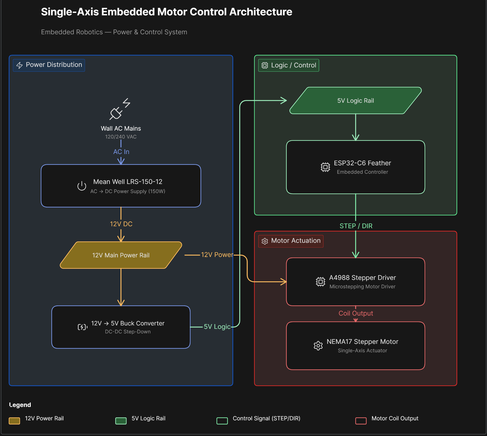

# Intelligent Robotic Arm Platform

A modular robotics platform focused on embedded motor control, ROS2 integration, telemetry, diagnostics, and scalable robotic manipulation infrastructure.

The project is being developed incrementally with emphasis on reliable hardware integration, structured firmware development, scalable power architecture, and disciplined engineering documentation.

Current development is centered on single-axis motion bring-up using an ESP32-C6 Feather, A4988 stepper driver, and NEMA17 stepper motor before expanding into multi-axis robotic manipulation.

---

# Current Development Status

Current milestone:
- Single-axis embedded motor control bring-up

Active focus areas:
- A4988 integration
- STEP/DIR motion control
- Power distribution architecture
- Current limiting and driver tuning
- Embedded firmware development
- Hardware reliability and debugging infrastructure

---

# Hardware Stack

- ESP32-C6 Feather
- Adafruit A4988 Stepper Driver
- NEMA17 Stepper Motor
- Mean Well LRS-150-12 Power Supply
- 12V → 5V Buck Converter
- Perma-Proto Board

---

# Software Stack

- ROS2 Jazzy
- Ubuntu 24.04 (WSL2)
- Python
- C++
- Embedded ESP32 firmware

---

# Current System Architecture

```text
ESP32-C6 Feather
        ↓ STEP/DIR
A4988 Stepper Driver
        ↓
NEMA17 Stepper Motor

Mean Well LRS-150-12
        ↓
12V Power Rail
```

---
## System Architecture Diagram


# Repository Structure

```text
docs/       → engineering documentation and architecture notes
firmware/   → ESP32 motor-control firmware
hardware/   → wiring diagrams, CAD, PCB planning, BOM
logs/       → engineering session logs and debugging records
media/      → photos, videos, screenshots, and testing artifacts
```

---

# Development Roadmap

- [ ] Single-axis motor bring-up
- [ ] Current limiting and driver tuning
- [ ] Limit switch integration
- [ ] Serial command protocol
- [ ] ROS2 communication bridge
- [ ] Multi-axis expansion
- [ ] Mechanical arm assembly
- [ ] Telemetry and diagnostics
- [ ] Vision integration

---

# Engineering Goals

This project is intended to emphasize:
- embedded systems engineering
- robotics integration
- scalable architecture
- debugging discipline
- power-system reliability
- structured firmware development
- long-term maintainability
- systems-level engineering practices
